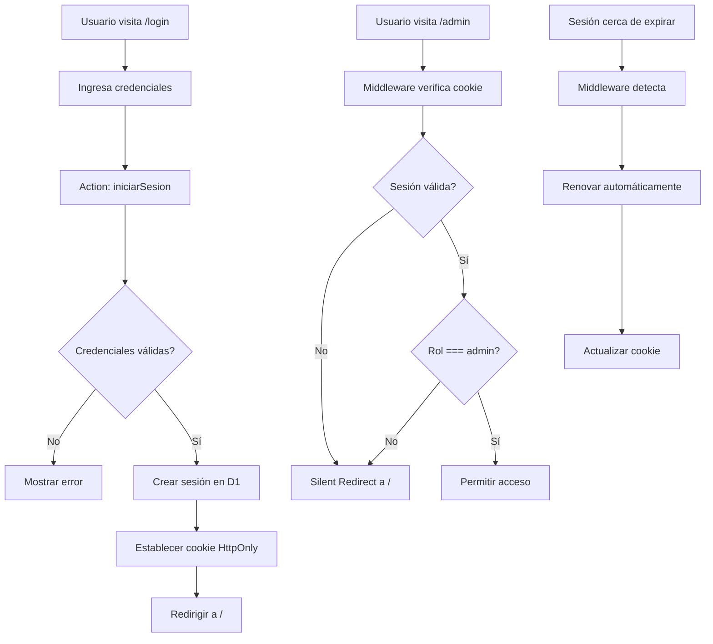

# Sistema de Autenticación - RH Interiors

## 🎯 Resumen

Se ha implementado un sistema completo de autenticación y autorización para RH Interiors con las siguientes características:

- ✅ Autenticación segura con PBKDF2 (Web Crypto API)
- ✅ Gestión de sesiones con tokens seguros
- ✅ Middleware para protección de rutas
- ✅ Renovación automática de sesiones
- ✅ Control de acceso basado en roles (admin/cliente)
- ✅ UI minimalista estilo Apple

## 📁 Archivos Creados/Modificados

### Base de Datos
- `schema.sql` - Tablas `Usuarios` y `Sesiones` agregadas

### Utilidades
- `src/utils/criptografia.ts` - Encriptación con PBKDF2
- `src/utils/sesion.ts` - Gestión de sesiones en D1

### Middleware y Acciones
- `src/middleware.ts` - Protección de rutas y renovación de sesiones
- `src/actions/index.ts` - Acciones de autenticación

### UI
- `src/components/IconoAcceso.tsx` - Componente React con transiciones
- `src/pages/login/index.astro` - Página de inicio de sesión
- `src/layouts/LayoutPrincipal.astro` - Integración de sesión en header
- `src/pages/admin/index.astro` - Validación de rol actualizada

### Scripts
- `scripts/crear-admin.ts` - Generador de usuarios admin

### Configuración
- `wrangler.toml` - Variables de entorno agregadas
- `src/env.d.ts` - Tipos TypeScript actualizados

## 🚀 Inicio Rápido

### 1. Aplicar Schema a la Base de Datos

**Local:**
```bash
bun wrangler d1 execute woodtong --local --file=./schema.sql
```

**Remoto:**
```bash
bun wrangler d1 execute woodtong --file=./schema.sql
```

### 2. Crear Usuario Administrador

**Generar comando SQL:**
```bash
bun run scripts/crear-admin.ts admin@woodtong.com tu_contraseña_segura
```

Esto generará un comando SQL que debes ejecutar. Copia y pega el comando mostrado.

**Ejemplo de salida:**
```bash
bun wrangler d1 execute woodtong --local --command="INSERT INTO Usuarios ..."
```

### 3. Iniciar Servidor de Desarrollo

```bash
bun run dev
```

### 4. Probar el Sistema

1. **Login**: Navega a `http://localhost:4321/login`
2. **Credenciales**: Usa el correo y contraseña que creaste
3. **Admin Panel**: Accede a `http://localhost:4321/admin`

## 🔐 Flujo de Autenticación



## 🛡️ Características de Seguridad

### Cookies Seguras
```typescript
{
  httpOnly: true,      // No accesible desde JavaScript
  secure: true,        // Solo HTTPS en producción
  sameSite: 'strict',  // Protección CSRF
  maxAge: 7 días       // Configurable
}
```

### Encriptación de Contraseñas
- Algoritmo: PBKDF2 con SHA-256
- Iteraciones: 100,000
- Salt: 16 bytes aleatorios
- Hash: 32 bytes

### Tokens de Sesión
- Generados con `crypto.getRandomValues()`
- 32 bytes (256 bits) de entropía
- Únicos por sesión

## 📝 Variables de Entorno

En `wrangler.toml`:

```toml
[vars]
SESSION_EXPIRATION_DAYS = "7"
REFRESH_THRESHOLD_HOURS = "1"
```

## 🎨 Componentes UI

### IconoAcceso
Muestra diferentes iconos según el estado de sesión:
- **Anónimo**: `person` (link a /login)
- **Autenticado**: `shopping_bag` (carrito)
- **Admin**: Badge verde adicional

### Página de Login
- Diseño minimalista estilo Apple
- Validación en tiempo real
- Feedback visual de carga
- Mensajes de error sutiles

## 🔄 Renovación Automática de Sesiones

El middleware verifica si la sesión expirará pronto:
- Umbral por defecto: 1 hora
- Si está cerca de expirar, renueva automáticamente
- Actualiza la cookie sin interrumpir al usuario

## 🚫 Protección de Rutas

### Rutas Protegidas
- `/admin/*` - Solo usuarios con rol `admin`

### Silent Redirect
Si un usuario sin permisos intenta acceder:
- Redirección a `/` sin mensajes de error
- Estilo Apple: minimalista y sin explicaciones

## 📊 Estructura de Base de Datos

### Tabla Usuarios
```sql
CREATE TABLE Usuarios (
    id_usuario INTEGER PRIMARY KEY AUTOINCREMENT,
    correo TEXT UNIQUE NOT NULL,
    clave_encriptada TEXT NOT NULL,
    rol TEXT DEFAULT 'cliente' CHECK(rol IN ('cliente', 'admin')),
    fecha_creacion DATETIME DEFAULT CURRENT_TIMESTAMP
);
```

### Tabla Sesiones
```sql
CREATE TABLE Sesiones (
    id_sesion INTEGER PRIMARY KEY AUTOINCREMENT,
    id_usuario INTEGER NOT NULL,
    token_sesion TEXT UNIQUE NOT NULL,
    token_refresco TEXT UNIQUE NOT NULL,
    expiracion DATETIME NOT NULL,
    fecha_creacion DATETIME DEFAULT CURRENT_TIMESTAMP,
    FOREIGN KEY (id_usuario) REFERENCES Usuarios(id_usuario) ON DELETE CASCADE
);
```

## 🧪 Testing

### Flujo Completo de Login
1. Visita `/login`
2. Ingresa credenciales admin
3. Verifica redirección a `/`
4. Confirma que el icono cambió a `shopping_bag`
5. Verifica que aparece enlace "Panel" en navegación

### Protección de Rutas
1. Sin login, intenta acceder a `/admin`
2. Verifica silent redirect a `/`
3. Con login admin, accede a `/admin`
4. Verifica acceso permitido

### Usuarios Anónimos
1. Sin login, navega a `/`
2. Verifica que la galería es visible
3. Abre modal de captación
4. Regístrate como prospecto
5. Verifica que funciona sin necesidad de cuenta

## 🐛 Troubleshooting

### Error: "Property 'usuario' does not exist"
- Asegúrate de que `src/env.d.ts` está actualizado
- Reinicia el servidor de desarrollo

### Error: "Session not found"
- Verifica que la tabla `Sesiones` existe en D1
- Ejecuta el schema nuevamente

### Cookie no se establece
- Verifica que estás usando HTTPS en producción
- En desarrollo, `secure: false` está configurado automáticamente

## 📦 Despliegue

### Cloudflare Pages

1. **Aplicar schema a D1 remoto:**
```bash
bun wrangler d1 execute woodtong --file=./schema.sql
```

2. **Crear admin en producción:**
```bash
bun run scripts/crear-admin.ts admin@tudominio.com contraseña_segura
# Ejecuta el comando SQL generado con --remote (sin --local)
```

3. **Desplegar:**
```bash
bun run build
bun wrangler pages deploy dist
```

## 🎯 Próximos Pasos

- [ ] Implementar "Recordarme" con tokens de larga duración
- [ ] Agregar recuperación de contraseña
- [ ] Implementar 2FA (autenticación de dos factores)
- [ ] Agregar logs de auditoría de sesiones
- [ ] Implementar límite de intentos de login

## 📚 Referencias

- [Astro Middleware](https://docs.astro.build/en/guides/middleware/)
- [Astro Actions](https://docs.astro.build/en/guides/actions/)
- [Cloudflare D1](https://developers.cloudflare.com/d1/)
- [Web Crypto API](https://developer.mozilla.org/en-US/docs/Web/API/Web_Crypto_API)
